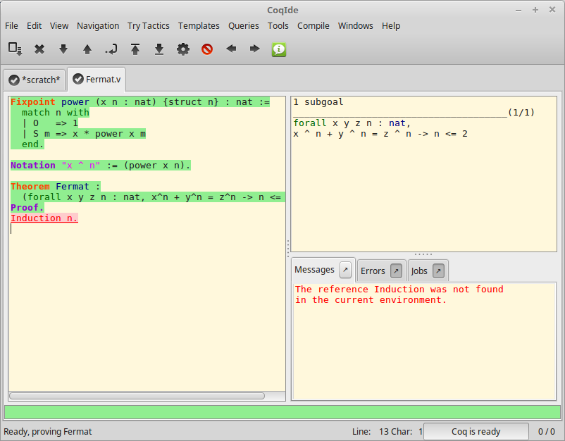
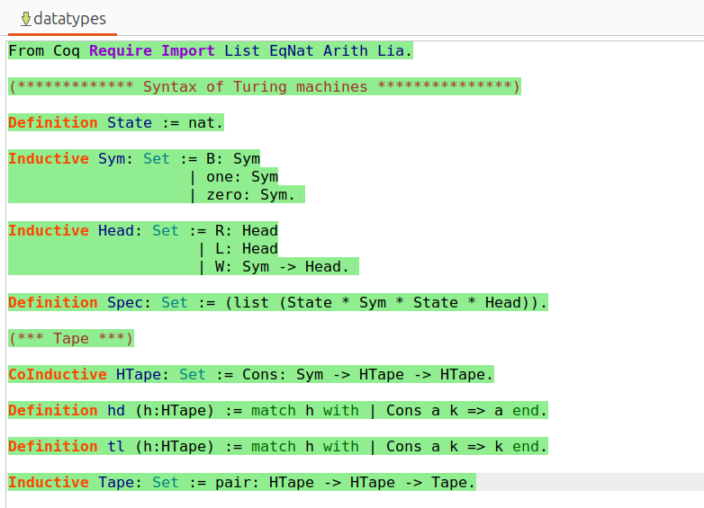
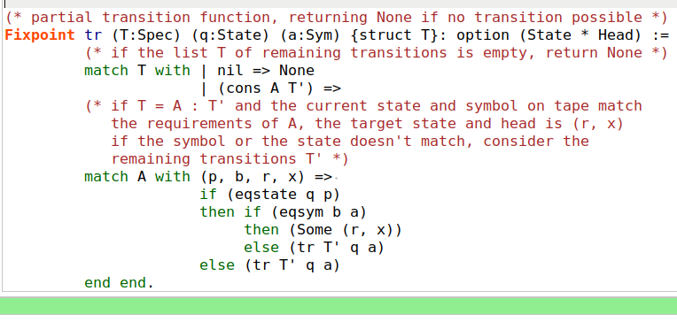
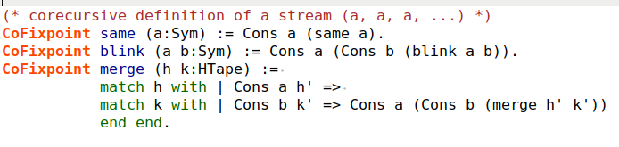
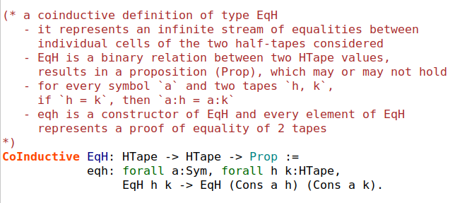
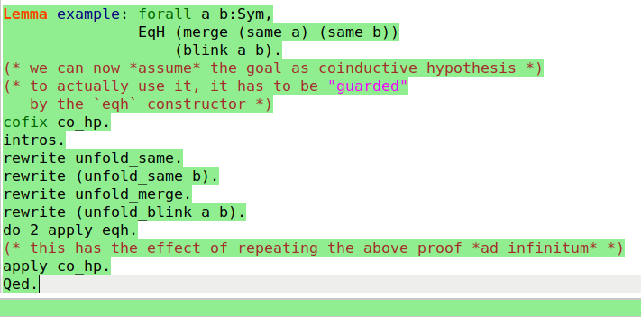

---
title:
- Formalizing Turing Computability
author:
- Paweł Balawender
date:
- February 26, 2025
# pandoc -t beamer prezentacja.md -o prezentacja.pdf --bibliography references.bib --citeproc  -M link-citations=true -V colortheme:crane -V theme:CambridgeUS --csl apa.csl
# pdftk A=inria-curryhoward.pdf B=prezentacja.pdf cat B1-7 A8-15 output out.pdf
---

# A classical result: HALT undecidable
- Suppose there exists a Python function `halts(prog: str) -> bool`{.python}
    which takes another Python program as input and returns `True`{.python} if it ever stops,
    `False`{.python} otherwise.

. . .

- Define
```python
def dither(prog: str) -> bool:
    if halts(prog): while True: pass
    else: return False
```

. . .

>- Now, if `dither(dither.__code__)`{.python} terminates,
    `halts(dither.__code__)`{.python} must have been false,
    which is absurd. So it must have looped. But this is only possible
    if `halts`{.python} was true, which also is absurd. So no such `dither`{.python} can exist.
>- This proof is as hand-wavy as it gets

# Why formalization matters
>- it can take years for the mathematical community to peer-review and accept a proof
>- what if all the reviewers miss an error?
>- what if there actually is an error in Fermat's Last Theorem?
>- if only you trust your Automated Theorem Prover and it accepts
   a formal proof, no matter how complicated, you can trust that it is correct

# How can you expect tax-payers to believe in this? (Inter-universal Teichmüller theory)


# The problem with proofs in Computational Complexity
>- it is way too cumbersome to write-down the details of proofs
>- but the details are important!

# Coq: intuition
>- a major Automated Theorem Prover
>- a functional programming language
>- very expressible type system, where types can represent mathematical theorems
>- if you construct an object of a given type, it is equivalent to proving
    the theorem represented by the type

# Coq: a screenshot


# Turing Machines in Coq
>- the language is total, i.e. every function terminates by design
>- but you need to represent the infinite tape of a Turing Machine as a type
>- and also, potentially infinite, computations

# Turing Machines in Coq
> [from: yannick.forster@inria.fr, 2024-12-03]
    Hi,
    the difficulty comes from verifying arguments about Turing machines in Coq. Even proofs that are simple on paper starts to blow up badly :(
    Our proof that lambda calculus can be simulated on Turing machines is simple on paper, horrible in Coq. There's also the work in Isabelle by Urban and colleagues translating Abacus machines to Turing machines, something like ITP 2013. This should be cited in our CPP paper. It was a lot, lot, lot of work. Both of these proofs can btw be seen as interpreters of very simple functional programming languages.

# Towards Turing computability via coinduction [@CIAFFAGLIONE201631]
>- Alberto Ciaffaglione formalizes big-step and small-step semantics of
   Turing Machines in Coq
>- this allows formal reasoning about their correctness
>- yields a formal proof of the undecidability of the halting problem

# Definitions
>- **State** : $p, q, i \in \mathbb{N} = \{0, 1, 2, \dots\}$ state
>- **Sym** : $a, b \in \{B, 1, 0\}$ alphabet symbol
>- **Head** : $x, y \in \{R, L, W(a)\}$ head operation
>- **Act** : $\alpha \in \text{State} \times \text{Sym} \times \text{State} \times \text{Head}$ action
>- **Spec** : $T, U, V ::= (\iota \to \alpha_i)_{\iota \in [0..n] (n \in \mathbb{N})}$ specification
>- **HTape** : $l, r ::= (\iota \to a \iota)_{\iota \in [0..\infty]}$ half tape (stream)
>- **Tape** : $s, t, u ::= \langle\langle l, r \rangle\rangle$ full tape (zipper)


# Coinductive types to represent infinite objects in Coq 
<!-- ```coq
Definition State := nat.
Inductive Sym: Set := B: Sym
                    | one: Sym
                    | zero: Sym. 
Inductive Head: Set := R: Head
                     | L: Head
                     | W: Sym -> Head. 
Definition Spec: Set := (list (State * Sym * State * Head)).
CoInductive HTape: Set := Cons: Sym -> HTape -> HTape.
Definition hd (h:HTape) := match h with | Cons a k => a end.
Definition tl (h:HTape) := match h with | Cons a k => k end.
Inductive Tape: Set := pair: HTape -> HTape -> Tape.
``` -->
{ width=80% }
<!--  -->

# Duality
- recursive functions consume values of an inductive type
- corecursive functions produce values in a coinductive type

# Transition function as represented by a Fixpoint definition
{ width=100% }

# Corecursive definitions of a tape
{ width = 60% }

# Corecursive definition of tape bisimilarity
{ width = 60% }

# Coinductive proof of example tapes bisimilarity
> The application of the coinductive hypothesis intuitively has the effect of repeating ad infinitum
    the initial fragment of the proof, thus realizing the “and so on forever” motto. From a technical point of view, the application
    of eqh and the subsequent call to the co_hp coinductive hypothesis correspond to the construction, via corecursion, of the
    proof term inhabiting the property to be proved, where the co_hp application is therefore a guarded corecursive call.

# Coq in action: 


# My contribution
- port Ciaffaglione's code from Coq 8.4pl5 (version from 2014) to 8.20.1 (newest stable)
- fix many proofs where they broke after version upgrade
- add package management (_CoqProject) handling, all the `Require` commands
- add installation and running instructions
- now you can really run this proof yourself, even in VSCode!
- [https://github.com/eerio/prezentacja-seminarium-1](https://github.com/eerio/prezentacja-seminarium-1)

# References {.allowframebreaks}

